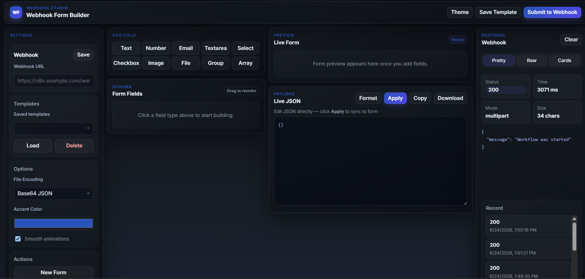

# Webhook Form Builder

> A lightweight, browser-based tool to visually build forms, preview live JSON payloads, and send data directly to any webhook endpoint — built for n8n and compatible with any REST API.



---

## What It Does

Webhook Form Builder lets you design a form schema visually, fill it out in a live preview, and fire the payload to a webhook in one click — no backend, no framework, no build step. Everything runs in a single HTML file.

It is especially useful when testing or prototyping n8n workflows, since you can rapidly iterate on field structures, adjust encoding modes, and inspect the raw response — all in one place.

---

## Features

- **Visual schema builder** — add Text, Number, Email, Textarea, Select, Checkbox, Image, File, Group, and Array fields
- **Live form preview** — see a rendered form update in real time as you build
- **Live JSON payload** — edit the JSON directly and sync it back to the form with Apply
- **Required field validation** — blocks submission and highlights missing fields with a shake animation
- **Multiple file encoding modes** — choose how files and data are sent (see below)
- **Response inspector** — view status, time, size, headers, and body in Pretty / Raw / Cards tabs
- **Request history** — last 8 responses saved and accessible in one click
- **Save & load templates** — persist form configs to localStorage
- **Export / Import config** — share form schemas as JSON files
- **Light & dark theme** — toggle in the top bar
- **Smooth animations** — can be disabled for accessibility

---

## File Encoding Modes

Choose the right mode in **Settings → File Encoding** based on what your form contains:

```
Has file/image fields?
├── No  → Binary Array JSON ✅
└── Yes
    ├── Need to read/process file content? → Base64 JSON ✅
    └── Need to store/upload the actual file? → Multipart ✅
```

### Binary Array JSON
Plain JSON with no file handling. Every value is a string, number, or boolean. Use this for all text-only forms — it is the most reliable mode and n8n always parses the body correctly.

### Base64 JSON
Files are converted to base64 strings and embedded inside the JSON body. Use this when your n8n workflow needs to read or process the file content (e.g. parse a PDF, analyse an image with AI). Keep in mind that base64 increases payload size by roughly 33%.

### Multipart Form Data
Files are sent as raw binary parts, exactly like a traditional HTML `<form enctype="multipart/form-data">`. Use this when you need to upload a real file to a storage service (Google Drive, S3, Dropbox) via n8n. Avoid using this mode when there are no file fields — n8n's test webhook may return `body: {}`.

---

## How to Use

1. Enter your **Webhook URL** in the Settings panel and click **Save**
2. Add fields using the **ADD FIELD** buttons (Text, Email, Group, etc.)
3. Configure each field — set a label, JSON key, and mark as **Required** if needed
4. Fill in the **Live Form** preview on the right
5. Verify the **Live JSON** payload looks correct
6. Click **Submit to Webhook** — the response appears instantly in the Response panel

---

## Project Structure

```
N8N/
├── index.html       # Full application — markup, logic, state
└── css/
    └── style.css    # All styles including light/dark theme variables
```

---

## Tech Stack

| Library | Purpose |
|---|---|
| [Axios](https://axios-http.com) | HTTP requests |
| [SortableJS](https://sortablejs.github.io/Sortable/) | Drag-to-reorder fields |
| [Inter](https://fonts.google.com/specimen/Inter) | UI font |
| Vanilla JS | Everything else — no framework |

---

## Notes

- The app runs entirely from a local `file://` path — no server needed
- Because of this, the browser sets `origin: null` in request headers, which is normal
- All state (fields, templates, responses) is saved to `localStorage` automatically
- Tested with n8n cloud webhook-test and production webhook URLs
